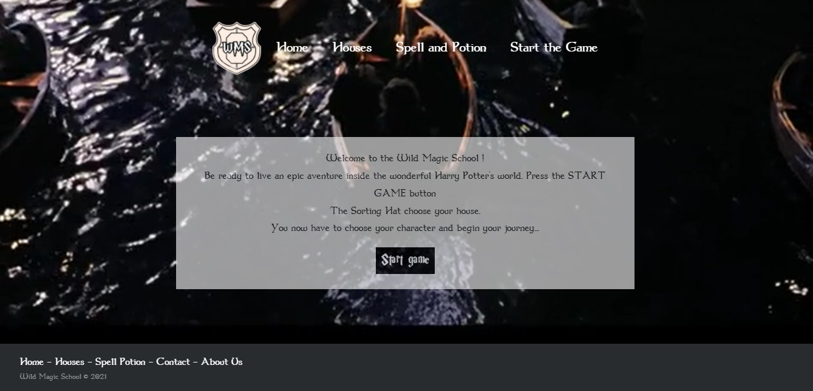

# Wild Magic School

Proudly presents: Wild Magic School, this app : https://wild-magic-school.netlify.app/.

"Welcome to the Wild Magic School !
Be ready to live an epic aventure inside the wonderful Harry Potter's world. The Sorting Hat choose your house. You now have to choose your character and begin your journey..."

It was born from 4 individuals.
It came as the second project for our training at Wild Code School (Nantes, Fr).

## Table of Contents

* [General Info](#general-info)
* [Technologies Used](#technologies-used)
* [Screenshots](#screenshots)
* [Setup](#setup)
* [Usage](#usage)
* [Project Status](#project-status)
* [Room for Improvement](#room-for-improvement)
* [Contact](#contact)

## General Information

As part of our training we had to create a react-app based on an API.
The team decided to make a game based on the wizarding world of Harry Potter.

## Technologies Used

For this project we used:
- Html, Css, Javascript and ReactJs
- NPM for additional packages
- Webpack to compile the final project.

## Screenshots

## Setup

Dependencies: 
  - axios,
  - bootstrap,
  - framer-motion,
  - react-router-dom,
  - reactjs-popup,
  - web-vitals.

## Usage

You can launch the project with npm start after you have installed all packages.
This project uses same commands like the basics create-react-app.

## Project Status

Project is deployed.

## Acknowledgements

Our thanks to :

⇒ Meta, for this incredible tool, ReactJs

⇒ Our trainer, [Jujuck](https://github.com/jujuck), who's continuously sharing his experiences and abilities

⇒ Ourselves, (yes) for all the hard work we put in

⇒ [ritaly](https://github.com/ritaly), for their magical readme.md template
"Drop the mic."

## Contact

Github : [@angeliquebesi](https://github.com/angeliquebesi)

Github : [@NanakiMathieu](https://github.com/NanakiMathieu)

Github : [@Ygerbaud](https://github.com/Ygerbaud)

Github : [@VictorPagnier](https://github.com/VictorPagnier)
